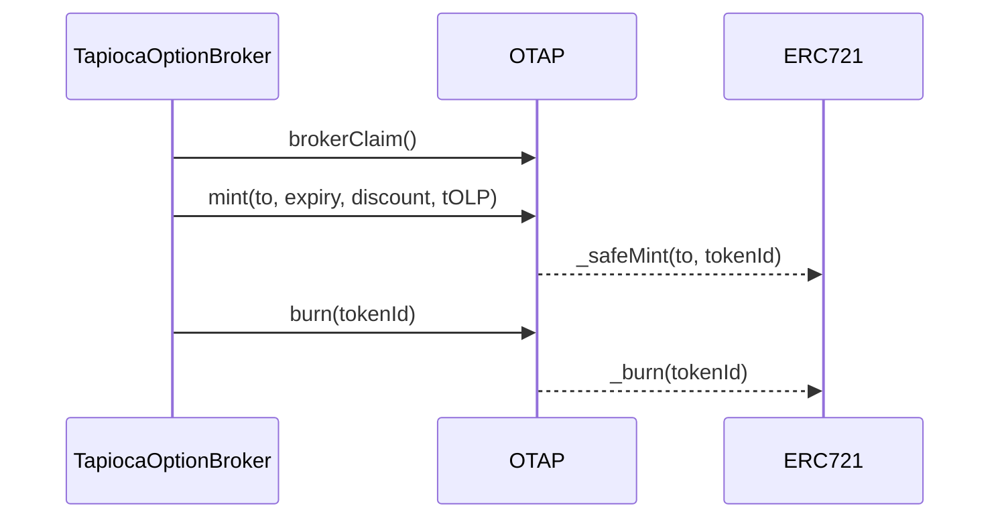

# OTAP (Option TAP) Contract

## Overview

The OTAP contract manages Option TAP tokens, which represent options on TAP. It handles minting, burning, and the basic properties of these options while implementing the ERC721 standard with additional features specific to options.

[Git Source](https://github.com/Tapioca-DAO/tap-token/blob/5c0f4b40f52cae1c74cc5a5e7d7082d755401d05/contracts/options/oTAP.sol)

## Contract Details

- **Name:** OTAP (Option TAP)
- **Type:** ERC721
- **Solidity Version:** 0.8.22

## Inheritance

OTAP inherits from:

- [ERC721](https://github.com/OpenZeppelin/openzeppelin-contracts/blob/master/contracts/token/ERC721/ERC721.sol)
- [ERC721Permit](https://github.com/Tapioca-DAO/tapioca-periph/blob/987adfa3cbd521e57b563134d49be5c61afb5dc6/contracts/utils/ERC721Permit.sol#L21)
- [ERC721Enumerable](https://github.com/OpenZeppelin/openzeppelin-contracts/blob/master/contracts/token/ERC721/extensions/ERC721Enumerable.sol)
- [ERC721NftLoader](https://github.com/Tapioca-DAO/tap-token/blob/5c0f4b40f52cae1c74cc5a5e7d7082d755401d05/contracts/erc721NftLoader/ERC721NftLoader.sol#L5)
- [PearlmitHandler](https://github.com/Tapioca-DAO/tap-utils/blob/1090c311cf3d948c3f76ec892d23b71a385915d6/contracts/pearlmit/PearlmitHandler.sol#L9)
- [BaseBoringBatchable](https://github.com/boringcrypto/BoringSolidity/blob/master/contracts/BoringBatchable.sol)

## Key Components

### State Variables

| Name         | Type                            | Visibility | Description                                                |
| ------------ | ------------------------------- | ---------- | ---------------------------------------------------------- |
| `mintedOTAP` | `uint256`                       | public     | Total number of OTAP tokens minted                         |
| `broker`     | `address`                       | public     | Address of the broker who has special privileges           |
| `options`    | `mapping(uint256 => TapOption)` | public     | Mapping of token IDs to their corresponding option details |

### Structs

```solidity
struct TapOption {
  uint128 entry; // time when the option position was created
  uint128 expiry; // timestamp, as once one wise man said, the sun will go dark before this overflows
  uint128 discount; // discount in basis points
  uint256 tOLP; // tOLP token ID
}
```

Struct representing the details of a TAP option

### Events

#### Mint

```solidity
event Mint(
  address indexed to,
  uint256 indexed tokenId,
  TapOption indexed option
);
```

Emitted when a new OTAP token is minted.

#### Burn

```solidity
event Burn(
  address indexed from,
  uint256 indexed tokenId,
  TapOption indexed option
);
```

Emitted when an OTAP token is burned.

## Functions

### Constructor

```solidity
constructor(IPearlmit _pearlmit, address _owner)
  ERC721NftLoader("Option TAP", "oTAP", _owner)
  ERC721Permit("Option TAP")
  PearlmitHandler(_pearlmit)
```

Initializes the OTAP contract.

**Parameters:**

- `_pearlmit`: Address of the Pearlmit contract for permit functionality
- `_owner`: Address of the contract owner

### Public/External Functions

#### mint

```solidity
function mint(
  address _to,
  uint128 _expiry,
  uint128 _discount,
  uint256 _tOLP
) external returns (uint256 tokenId)
```

Mints a new OTAP token. Only the broker can mint tokens.

**Parameters:**

- `_to`: Address to receive the minted token
- `_expiry`: Timestamp when the option expires
- `_discount`: Discount in basis points
- `_tOLP`: tOLP token ID associated with this option

**Returns:** The ID of the newly minted token

#### burn

```solidity
function burn(uint256 _tokenId) external
```

Burns an existing OTAP token. Only the broker can burn tokens.

**Parameters:**

- `_tokenId`: ID of the token to burn

#### brokerClaim

```solidity
function brokerClaim() external
```

Allows the initial claim of the broker role. Can only be called once to set the broker.

### Internal Functions

## Internal Functions

These internal functions are crucial for the contract's operation but are not directly callable by external actors. They primarily handle internal logic and override functions from parent contracts.

### \_baseURI

```solidity
function _baseURI() internal view override(ERC721, ERC721NftLoader) returns (string memory)
```

Returns the base URI for computing `tokenURI`.

**Returns:** The base URI string

### supportsInterface

```solidity
function supportsInterface(bytes4 interfaceId)
    public
    view
    virtual
    override(ERC721Enumerable, ERC721)
    returns (bool)
```

Checks if the contract supports a given interface.

**Parameters:**

- `interfaceId`: The interface identifier

**Returns:** `bool` - True if the contract supports the interface, false otherwise

### \_beforeTokenTransfer

```solidity
function _beforeTokenTransfer(address from, address to, uint256 firstTokenId, uint256 batchSize)
    internal
    override(ERC721, ERC721Enumerable)
```

Hook that is called before any token transfer.

**Parameters:**

- `from`: Address tokens are transferred from
- `to`: Address tokens are transferred to
- `firstTokenId`: The first token ID in the batch being transferred
- `batchSize`: The number of tokens being transferred in the batch

### \_afterTokenTransfer

```solidity
function _afterTokenTransfer(address from, address to, uint256 firstTokenId, uint256 batchSize)
    internal
    virtual
    override(ERC721, ERC721Permit)
```

Hook that is called after any token transfer.

**Parameters:**

- `from`: Address tokens are transferred from
- `to`: Address tokens are transferred to
- `firstTokenId`: The first token ID in the batch being transferred
- `batchSize`: The number of tokens being transferred in the batch

## Diagrams

### Sequence Diagram



## Errors

- `OnlyBroker()`: Thrown when a function restricted to the broker is called by another address
- `OnlyOnce()`: Thrown when an action that can only be performed once is attempted again
